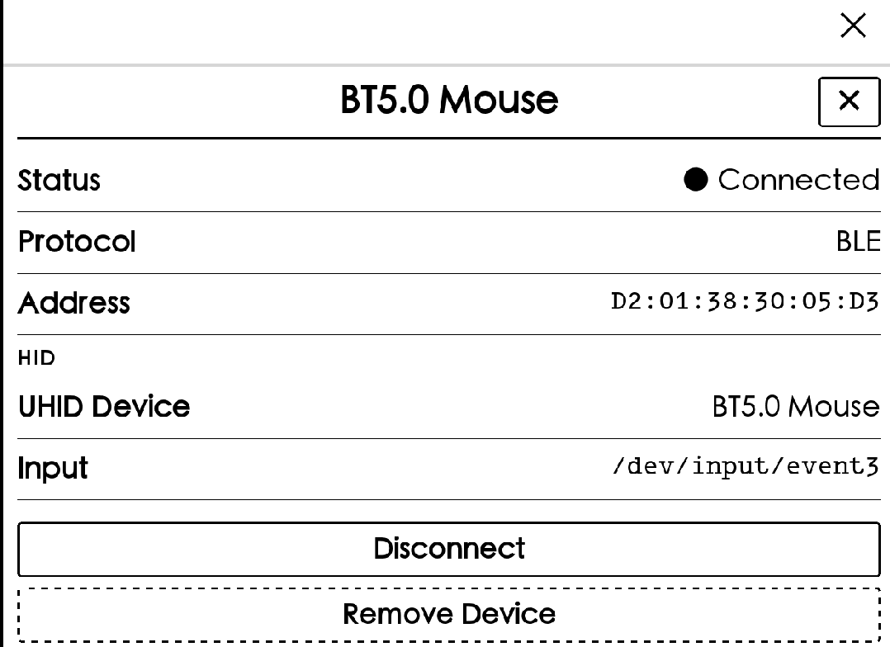
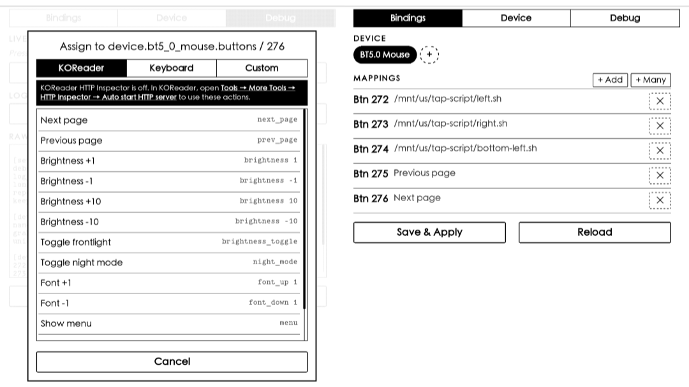

## 蓝牙控制翻页

使用蓝牙键盘、鼠标等蓝牙设备来控制kindle原生系统和koreader的翻页。

相关脚本tap-script文件夹放到kindle根目录 ，跟documents同级。

前置条件：
- kindle 设备已经越狱
- 安装 KUAL、KOReader、[USBNetLite](https://github.com/notmarek/kindle-usbnetlite)
- 安装蓝牙插件 [kindle-hid-passthrough](https://github.com/zampierilucas/kindle-hid-passthrough) 和设备事件映射插件 [kindle-button-mapper-rs](https://github.com/zampierilucas/kindle-button-mapper-rs)


本人设备是kpw5，如果你也是kpw5，在使用kindle-hid-passthrough之前需要先注意下面两个问题，目前还没解决，其他设备自行验证：

**第一**：kindle-hid-passthrough 的开机执行脚本会导致kwp5无限重启，所以要去掉。参考[issue87](https://github.com/zampierilucas/kindle-hid-passthrough/issues/87)，如果不幸无限重启了，长按电源键40秒强制重启慢慢等。

```jsx
# 修改根目录为读写
mount -o remount,rw /

# 禁用hid-passthrough服务
mv /etc/upstart/hid-passthrough.conf /etc/upstart/hid-passthrough.conf.disabled

# 重新挂载根目录为只读
mount -o remount,ro /
```

**第二**：蓝牙和wifi有冲突，参考 [issue88](https://github.com/zampierilucas/kindle-hid-passthrough/issues/88)

在手动关wifi之前必须先关闭蓝牙，打开BTManager关闭蓝牙，一旦没先关闭蓝牙再手动关了wifi，就无法再打开wifi了，只能重启kindle。放久了锁屏断开wifi解锁自动连wifi则没这个问题。

### 1.打开BTManager连接蓝牙设备

连接上蓝牙设备后点击设备可以看到详细信息，input一行就是这个设备的事件输入。比如我这个蓝牙鼠标的事件输入是 `/dev/input/event3`。



### 2.打开Button Mapper配置设备事件

点击Debug一栏再点击Start Capture，可以看到你连接的蓝牙设备比如我的鼠标是`/dev/input/event3`。然后按下你要绑定的按键比如鼠标侧边前键，可以看到按钮映射的id比如276，此时可以选择将这个按键绑定到KOReader的Next Page。

然后到Bindings一栏点击Save&Apply保存并重启服务。



如果只是需要绑定KOReader的翻页不用原生系统到这里就可以了。

### 3. 绑定原生系统翻页

从上一个步骤已经可以拿到各个按键的id号，比如我的鼠标左右键分别是272、273，想要绑定到原生系统的翻页，需要先获取原生系统的翻页坐标。

不同kindle型号的屏幕分辨率不一样，我的kpw5是1236 × 1648，估计一下点击左下边xy坐标为（100，1000）就是上一页，右下边的坐标为（1200，1000）就是下一页，左下角落（10，1645）就是切换进度条。

还有另一方法是ssh连接（USBNetLite插件）到kindle，监听触摸事件：

```bash
evtest /dev/input/event1
```

然后点击kindle屏幕就可看到具体的坐标输出，(MT X)和(MT Y)这两个就是你要的坐标：

```
[root@kindle tmp]# evtest /dev/input/event1
Input driver version is 1.0.1
Input device ID: bus 0x0 vendor 0x0 product 0x0 version 0x0
Input device name: "pt_mt"
Supported events:
  Event type 0 (Sync)
  ......日志省略......
Testing ... (interrupt to exit)
Event: time 1784689208.159086, type 3 (Absolute), code 57 (MT Tracking ID), value 0
Event: time 1784689208.159086, type 3 (Absolute), code 53 (MT X), value 624
Event: time 1784689208.159086, type 3 (Absolute), code 54 (MT Y), value 83
Event: time 1784689208.159086, type 3 (Absolute), code 58 (Pressure on contact area), value 109
```

不过实在没必要，按照屏幕分辨率估算一下就行。

可以使用tap-script目录里的tap.lua脚本做下测试，tap.lua 是用来模拟触摸屏幕的脚本。

打开一本书，在终端执行tap.lua脚本，在后面带上xy坐标 10 1000，观察屏幕反应：

```
lua /mnt/us/page-turn/tap.lua 10 1000
```

将点击左边、点击右边和点击左下角三个命令写成三个脚本left.sh、right.sh和bottom-left.sh，然后编辑 /mnt/us/kindle-button-mapper/config.ini，把按键id和脚本对上就行了。最后在kindle上打开Button Mapper，在Bindings一栏先点击Reload加载配置，再点击Save&Apply保存并重启服务，完毕。

```

[settings]
debounce_ms = 0
log_buttons = true
long_press_ms = 500
repeat_ms = 100
keep_awake = true

[device.bt5_0_mouse]
name = BT5.0 Mouse
grab = false
uniq = D2:01:38:30:05:D3

[device.bt5_0_mouse.buttons]
272 = /mnt/us/tap-script/left.sh
273 = /mnt/us/tap-script/right.sh
274 = /mnt/us/tap-script/bottom-left.sh
275 = /mnt/us/kindle-button-mapper/scripts/koreader.sh prev_page
276 = /mnt/us/kindle-button-mapper/scripts/koreader.sh next_page
```

## 标注转换成markdown文件并部署为网页

在kindle上做的标注或书签会被记录到My Clippings.txt问价。

markdown文件夹的kindle.py程序用于将My Clippings.txt转换成markdown文件，放到Hexo网站的效果如[此网站](https://zgshen.github.io/kindle/)

My Clippings.txt和kindle.py放到Hexo项目的source文件夹下，Hexo的Github Action相关配置节点参考：

```
...省略...
- name: Hexo deploy
run: |
    hexo clean
    python3 kindle.py
    cd ..
    hexo g
    hexo d
```
